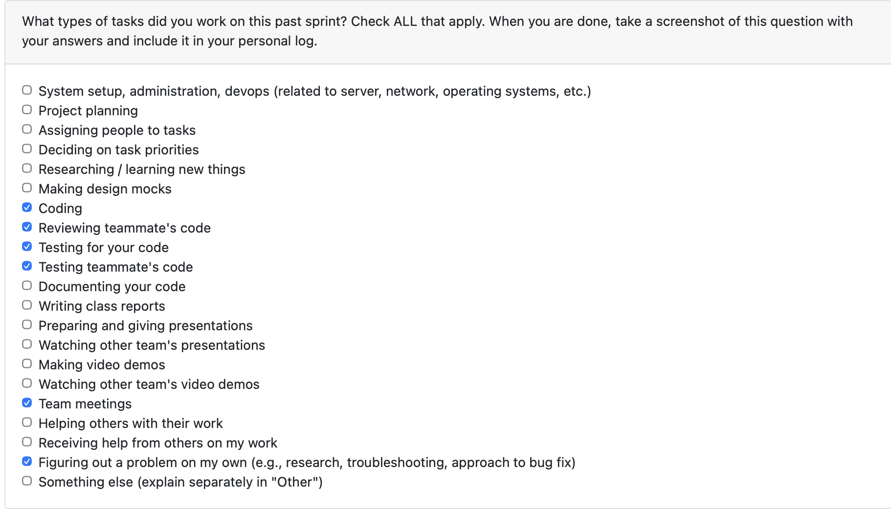

# Personal Log - Amani Lugalla
## 2026-JAN-11 to 2026-JAN-18

### Type of Tasks Worked On

### Recap of Week's Goals
- Improve CLI readability and consistency in the main interface.
- Standardize prompts and section formatting for scan outputs.
- Add a quick summary view before detailed scan results.

### Features Assigned (Project Plan)
- CLI readability improvements for scan workflows.
  
### Tasks from Project Board
| Feature | Task | Status (Completed/In Progress) | Notes |
|------|------|-------------------------------|-------|
| CLI readability improvements | Standardize menu/section output | Completed | Added helper functions for menu and section formatting |
| CLI readability improvements | Improve scan detail presentation | Completed | Added summary block and clearer headers for scan output |
| CLI readability improvements | Consistent prompt wording | Completed | Unified "return" phrasing for numeric prompts |

### Completed Tasks (Last 2 Weeks)
- Refactored main CLI output to use shared menu/section helpers.
- Added a scan summary section for quick context before detailed tables.
- Standardized numeric prompt language across scan views.

### In-Progress Tasks 
- FastAPI backend setup for frontend communication (API endpoints)

## [Date Range]  
2025-11-23 to 2025-11-30

### Type of Tasks Worked On
- 

### Recap of Week's Goals
- Expand and refine the database layer to support richer, future-proof analysis.
- Build supporting helper functions for project storage, résumé extraction, and insight deletion.
- Prepare presentation slides explaining database design choices and future directions.
- Introduce plans for future LLM-powered analysis and integration.

### Features Assigned (Project Plan)
- Extend the SQLite schema to include all relevant project metadata and analysis fields.
- Implement new DB helper functions for storing and retrieving structured analysis.
- Add slide content covering DB rationale, current implementation, and long-term roadmap.
- Outline how future LLM integration will enhance project analysis, skill inference, and résumé generation.

### Tasks from Project Board
| Task | Status (Completed/In Progress) | Notes |
|------|-------------------------------|-------|
| Expand DB schema with new fields | Completed | Added project_id, user_id, consent, analysis_mode, analysis_data, file_tree, resume_bullets |
| Implement insight storage helper | Completed | `store_project_insights` fully implemented |
| Add retrieval functions for summaries | Completed | Added `list_project_summaries` |
| Add résumé extraction feature | Completed | Implemented `get_resume_bullets` |
| Add deletion function | Completed | `delete_project_insights` now safely removes DB entries |
| Update existing tests | Completed | All old tests updated to match new structure |
| Add new tests for new helpers | Completed | Full coverage for insights, summaries, bullets, deletion |
| Create presentation slides | Completed | Covered DB design, SQLite choice, current vs future state |
| Add future LLM integration section | Completed | Slides outline planned advanced analysis and résumé generation |

### Completed/In-Progress Tasks (Last 2 Weeks)
- Expanded SQLite schema to store project metadata, analysis results, file trees, and résumé bullets.
- Added helper functions for saving, retrieving, and deleting complex analysis outputs.
- Updated and expanded the automated test suite to cover the new features.
- Created presentation slides explaining database choices, JSON-first strategy, and future migration to structured columns.
- Added forward-looking slide content on LLM-based analysis, automated skill extraction, and model-driven résumé generation.

### Additional Context (Optional)
- N/a

## [Date Range]
2025-11-16 to 2025-11-23

### Type of Tasks Worked On

---

### Recap of Week's Goals

Improve performance of the ZIP file parsing and validation system.
Reduce redundant operations such as multiple ZIP file openings and repeated decompression.
Maintain method names and existing functionality to avoid breaking changes.
Ensure all improvements are validated through automated tests.
Clean up code to improve readability and long-term maintainability.

---

### Features Assigned (Project Plan)

Performance Optimization: Reduce unnecessary operations in ZIP validation and extraction logic.
Refactor for Efficiency: Reuse the same ZipFile handle instead of reopening archives multiple times.
Redundancy Removal: Eliminate repeated metadata reads and double decompression.
Test Alignment: Update and correct test cases to match optimized behavior.
Memory Efficiency: Skip directory entries when building the file tree.

---

### Tasks from Project Board

| Task | Status (Completed/In Progress) | Notes |
|------|-------------------------------|------|
| Remove redundant ZIP file openings | ✅ Completed | Reused a single `ZipFile` handle for validation and extraction |
| Eliminate unnecessary decompression (`testzip`) | ✅ Completed | Removed expensive default full-archive scan for performance |
| Reuse metadata from `infolist()` | ✅ Completed | Prevented redundant re-reads of archive metadata |
| Filter directory entries from file tree | ✅ Completed | Reduced memory usage and improved output quality |
| Update and align unit tests | ✅ Completed | Modified tests to reflect optimized and corrected behavior |
| Clean up comments and structure | ✅ Completed | Improved readability without changing public interfaces |
---

### Completed/In-Progress Tasks (Last 2 Weeks)

Optimized check_file_validity by avoiding multiple ZIP file reads.
Updated extract_zip_to_temp to accept an existing zip_ref and prevent reopening.
Improved file tree generation performance by filtering non-file entries.
Refactored and clarified test cases to match the actual logic.
Ensured no breaking changes through consistent function names and behavior.
Planning further performance improvements via streamed extraction and generator-based file loading (future work).

---

### Additional Context (Optional)

This week focused on improving efficiency and maintainability without changing the external API. By removing redundant operations and unnecessary decompression passes, ZIP processing is now significantly faster and more resource-efficient, especially for large files. These changes make the system more scalable while preserving full backward compatibility. Next steps include exploring streamed extraction and lazy loading for even larger archives.

## [Date Range]

2025-11-02 to 2025-11-09

### Type of Tasks Worked On

* Database design and implementation
* Backend integration for data persistence
* Troubleshooting MySQL connection and authentication issues
* Environment setup and dependency management (`venv`, pip, MySQL connector)
* Schema creation and initial testing of CRUD operations

---

### Recap of Week's Goals

* Design and implement a robust database schema for project data storage.
* Integrate the database with the Python backend to enable data persistence.
* Verify that users and projects can be created, stored, and retrieved successfully.
* Establish a local MySQL development environment and resolve configuration issues.

---

### Features Assigned (Project Plan)

* **Database Integration:** Implement a MySQL backend with auto-creation and initialization logic.
* **Persistence Layer:** Replace placeholder storage logic with a functional `database_raw.py` script.
* **Schema Definition:** Create a `schema.sql` file outlining table structures and relationships.

---

### Tasks from Project Board

| Task                                                          | Status (Completed/In Progress) | Notes                                                                                |
| ------------------------------------------------------------- | ------------------------------ | ------------------------------------------------------------------------------------ |
| Design database schema for users, projects, and relationships | ✅ Completed                    | Schema finalized and saved as `schema.sql`.                                          |
| Implement Python MySQL integration script                     | ✅ Completed                    | Created `database_raw.py` with auto-creation and CRUD helpers.                       |
| Test database initialization and connections                  | ✅ Completed                    | Verified successful MySQL connection, DB creation, and data insertion.               |
| Troubleshoot MySQL authentication and permissions             | ✅ Completed                    | Resolved `caching_sha2_password` and access issues; created app-specific MySQL user. |
| Update project documentation                                  | ✅ Completed                    | Added commit message, PR template, and documentation updates for DB setup.           |

---

### Completed/In-Progress Tasks (Last 2 Weeks)

* Completed: `schema.sql` design and creation.
* Completed: Implementation of `database_raw.py` with connection handling and CRUD operations.
* Completed: MySQL local environment configuration and virtual environment setup.
* Completed: Manual testing of data insertion and retrieval through Python.
* In Progress: Planning to extend database schema with `skills`, `artifacts`, and `contributions` tables.

---

### Additional Context (Optional)

This week focused on backend persistence and setup reliability. Several issues with MySQL authentication and permissions were resolved through iterative debugging, resulting in a stable connection workflow.
Next steps include expanding the schema for advanced project metrics and integrating the backend with the upcoming REST API layer.

## [Date Range]  
2025-09-28 to 2025-10-05

### Type of Tasks Worked On

### Recap of Week's Goals
- DFD Level 0

### Features Assigned (Project Plan)
- DFD Level 0

### Tasks from Project Board
| Task | Status (Completed/In Progress) | Notes |
|------|-------------------------------|-------|
|  DFD Level 0 | Completed | … |

### Completed/In-Progress Tasks (Last 2 Weeks)
- DFD Level 0
- Requirements, Testing, Requirement Verification.

### Additional Context (Optional)
- N/a

## [Date Range]  
2025-09-21 to 2025-09-28

### Type of Tasks Worked On
- 

### Recap of Week's Goals
- Finalize Project Proposal
- Finalize System Architecture Diagram

### Features Assigned (Project Plan)
- Task 4; Requirements, Testing, Requirement Verification.

### Tasks from Project Board
| Task | Status (Completed/In Progress) | Notes |
|------|-------------------------------|-------|
| Task 4 | Completed | … |

### Completed/In-Progress Tasks (Last 2 Weeks)
- Task 4 ✅

### Additional Context (Optional)
- N/a
